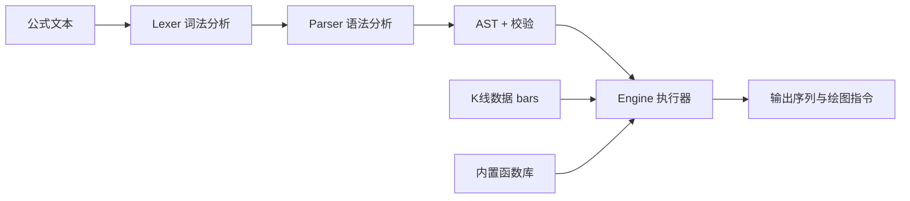

# 通达信公式解析与执行引擎

Feature Name: tdx-formula-engine
Updated: 2026-08-05

## Description

本特性为 TDX Finance MCP 项目新增通达信公式（TDX Formula）解析与执行引擎，支持全部四类公式（技术指标、条件选股、交易系统、五彩 K 线），内置 100+ 常用函数，可直接在任意标的 K 线数据上执行用户输入的公式文本，输出各输出线序列、交易信号与绘图指令数据。

**实现策略**：参考 [formula-go](https://github.com/DTrader-store/formula-go)（ISC 许可）的分层架构（lexer/parser/interpreter/engine）与 85 个内置函数、8 个绘图事件函数实现思路，按本项目约定完全重写，数据模型直接复用项目 `indicator.Bar`，不引入任何新的外部模块依赖；复合指标函数（MACD/KDJ/RSI/BOLL 等）复用项目 `indicator` 引擎，最终内置函数规模达 100+。

## Architecture



整体数据流：公式文本经词法分析切分为 Token，再经语法分析构建 AST；执行器基于输入 K 线数组对 AST 做数组式求值，输出各输出线的序列、交易信号序列与绘图指令数据。MCP 工具层与 REST API 层通过 `formula.Engine` 门面调用，解析与执行完全无状态。

## Components and Interfaces

### 包结构 `formula/`

参考 formula-go 分层（lexer/parser/ast/interpreter/engine/types/errors），按项目约定合并为单包：

| 文件 | 职责 |
|------|------|
| `token.go` | Token 类型、关键字、运算符定义 |
| `lexer.go` | 词法分析器（含注释、字符串、颜色/线宽属性） |
| `ast.go` | AST 节点类型与公式类型枚举 |
| `parser.go` | 递归下降语法分析器（Pratt 优先级） |
| `builtin.go` | 内置函数注册表与基础函数实现（数学/引用/逻辑/统计） |
| `builtin_complex.go` | 复合指标函数（复用 indicator 引擎：MACD/KDJ/RSI/BOLL 等） |
| `eval.go` | 数组式求值执行器（含绘图事件输出） |
| `engine.go` | 对外门面 API：Parse / Execute / ListFunctions |

核心数据模型：

```go
type Series []float64             // 序列，长度恒等于输入 K 线长度
type Value struct {
    Single  float64               // 标量
    Array   []float64             // 序列
    Text    string                // 字符串（DRAWTEXT 等）
    Draws   []DrawingEvent        // 绘图事件
    IsArray bool
    IsString bool
    IsDraw  bool
}
```

输入 K 线直接使用 `indicator.Bar`（Open/High/Low/Close/Vol/Amount），执行前将其提取为 CLOSE/HIGH/LOW/OPEN/VOL/AMOUNT 内置序列，无需新增 MarketData 类型。

### 门面 API

```go
type Engine struct{}

func NewEngine() *Engine

type ParseResult struct {
    AST          *Program    `json:"ast"`
    OutputNames  []string    `json:"output_names"`
    FormulaType  FormulaType `json:"formula_type"`
    PlotCalls    []PlotCall  `json:"plot_calls,omitempty"`
}

func (e *Engine) Parse(src string) (*ParseResult, error)

type ExecuteResult struct {
    FormulaType FormulaType               `json:"formula_type"`
    Outputs     map[string][]float64      `json:"outputs"`
    Meta        map[string]OutputMeta     `json:"meta"`
    Signals     []Signal                  `json:"signals,omitempty"`
    BKColor     []float64                 `json:"bk_color,omitempty"`
    Plots       []PlotRender              `json:"plots,omitempty"`
    NaNCount    map[string]int            `json:"nan_count"`
}

func (e *Engine) Execute(src string, bars []indicator.Bar) (*ExecuteResult, error)

func (e *Engine) ListFunctions() []FunctionInfo
```

### Token 定义

| Token 类型 | 示例 |
|------------|------|
| NUMBER | `12.5` |
| STRING | `"买入"` |
| IDENT | `MA`, `CLOSE`, `MA5` |
| 运算符 | `+ - * / ^` |
| 比较符 | `> < >= <= = <>` |
| 逻辑词 | `AND OR NOT` |
| 分隔符 | `( ) ; , : :=` |
| 属性关键字 | `COLORxxx LINETHICKn STICK POINTDOT CIRCLEDOT CROSSDOT` |
| 注释 | `//...` `{...}` |

### AST 节点

```go
type Program struct { Stmts []Stmt }

type Stmt interface{ stmt() }

type AssignStmt struct { Name string; Expr Expr }        // 中间变量 :=
type OutputStmt struct { Name string; Expr Expr; Attrs []Attr } // 输出线 :
type TradeSignalStmt struct { Kind string; Expr Expr }   // ENTERLONG/EXITLONG/ENTERSHORT/EXITSHORT
type BKColorStmt struct { Expr Expr }                    // BKCOLOR
type PlotCallStmt struct { Func string; Args []Expr; Attrs []Attr } // DRAWTEXT/DRAWICON/STICKLINE...

type Expr interface{ expr() }

type NumberExpr struct { Val float64 }
type StringExpr struct { Val string }
type IdentExpr struct { Name string }
type SeriesRefExpr struct { Field string }   // C O H L V AMOUNT
type UnaryExpr struct { Op string; X Expr }
type BinaryExpr struct { Op string; L, R Expr }
type CallExpr struct { Func string; Args []Expr }
```

### 公式类型推断

```go
type FormulaType int
const (
    FormulaIndicator FormulaType = iota   // 技术指标
    FormulaSelection                       // 条件选股
    FormulaTrade                           // 交易系统
    FormulaColorful                        // 五彩 K 线
)
```

推断规则：含 `ENTERLONG/EXITLONG/ENTERSHORT/EXITSHORT` 输出 → Trade；含 `BKCOLOR` → Colorful；仅含输出线 → Indicator；无输出线且最终表达式为布尔 → Selection。

### 内置函数库分类（100+）

移植 formula-go 的 85 个基础函数 + 8 个绘图函数，并补复合指标函数复用 indicator 引擎：

| 分类 | 函数 |
|------|------|
| 数学 | MAX MIN ABS SQRT POW EXP LN LOG MOD FLOOR CEILING ROUND ROUND2 INTPART FRACPART SIGN SIN COS TAN ASIN ACOS ATAN |
| 均线 | MA EMA SMA WMA DMA |
| 统计 | STD STDP STDDEV VAR VARP DEVSQ AVEDEV FORCAST SLOPE COVAR RELATE BETA |
| 引用 | REF REFV REFX REFXV HHV LLV HHVBARS LLVBARS CURRBARSCOUNT TOTALBARSCOUNT ISLASTBAR BARSTATUS SUMBARS |
| 逻辑 | CROSS LONGCROSS IF IFF IFN NOT BETWEEN RANGE CONST VALUEWHEN DRAWNULL COUNT EVERY EXIST EXISTR BARSLAST BARSCOUNT BARSSINCE BARSLASTCOUNT UPNDAY DOWNNDAY NDAY LAST FILTER SUM |
| 绘图 | DRAWTEXT DRAWICON DRAWNUMBER STICKLINE DRAWLINE POLYLINE DRAWBAND DRAWKLINE |
| 复合指标（复用 indicator） | MACD KDJ RSI BOLL CCI ROC WR BIAS TRIX DMI EXPMA ATR OBV VR MFI BRAR EMV DPO MTM PSY BBI SAR VWAP AROON |

复合指标函数适配层将 `indicator.IndicatorResult`（Values/Line2/Line3）映射为多输出序列：
- 单输出指标（ATR/ROC/PSY/EXPMA/MTM/DPO/OBV/VWAP/SAR）→ `名:函数(参数)`
- 多输出指标（MACD→DIF/DEA/MACD、KDJ→K/D/J、RSI→RSI1/RSI2/RSI3、BOLL→MID/UPPER/LOWER）→ 采用 `MACD_DIF:` 形式命名输出线，或按通达信 `DIFF:EMA(CLOSE,12)-EMA(CLOSE,26)` 展开式执行

技术指标类函数复用 `indicator` 包（MACD/KDJ/RSI/BOLL/DMI/ATR/WR/CCI/BIAS/OBV/VR/EMV/MFI/BRAR/ASI/TRIX/DPO/MTM/ROC/EXPMA/BBI/PSY/SAR/VWAP/AROON 等，见 indicator/indicator.go:398-1145）。

### 函数注册表

```go
type Function func(args []*Value, bars []indicator.Bar) (*Value, error)
type FunctionInfo struct { Name string; Category string; Arity string; Description string }

func RegisterFunc(name, category, description string, fn Function)
func lookupFunc(name string) (*builtinFn, bool)
func ListFunctions() []FunctionInfo
```

## Data Models

### 执行上下文

```go
type Interpreter struct {
    Bars      []indicator.Bar
    Variables map[string]*Value   // 内置行情序列 + 中间变量
    Outputs   []outputDeclaration // 输出线声明（名 + 值 + 样式）
    Functions *registry
    ExprCount int
}
```

### 绘图指令

```go
type DrawingEvent struct {
    Function string             `json:"function"` // DRAWTEXT/DRAWICON/STICKLINE...
    BarIndex int                `json:"bar_index"`
    Values   map[string]float64 `json:"values"`
    Text     string             `json:"text,omitempty"`
    Meta     map[string]string  `json:"meta,omitempty"`
}
```

### 输出元信息

```go
type OutputMeta struct {
    Name      string `json:"name"`
    Color     string `json:"color,omitempty"`
    LineWidth int    `json:"line_width"`
    Style     string `json:"style"`   // LINE/STICK/POINTDOT/CIRCLEDOT/CROSSDOT
}
```

### 交易信号

```go
type Signal struct {
    Kind string `json:"kind"`   // ENTERLONG/EXITLONG/ENTERSHORT/EXITSHORT
    Index int   `json:"index"`  // 最后一根触发 K 线索引
    Price float64 `json:"price"`
}
```

## Correctness Properties

- **长度一致性**：任何输出序列长度恒等于输入 K 线长度；常量标量广播为等长序列。
- **顺序求值**：语句按书写顺序求值，中间变量在引用前已计算；未定义变量引用返回错误。
- **NaN 语义**：窗口未满（如 MA 前 period-1 根）输出 NaN；参与算术时 NaN 传播；结果中 NaN 数量被统计。
- **无状态**：Engine 不缓存任何执行结果，相同输入恒得相同输出。
- **布尔语义**：比较/逻辑结果以 1.0/0.0 表示，非零即真。
- **优先级**：括号 > 函数调用/一元 > 幂 > 乘除 > 加减 > 比较 > 逻辑（AND 优先于 OR）。
- **基准正确性**：MA(C,5)、REF(C,1)、HHV(H,10) 等基础函数输出与通达信软件手工计算结果一致（误差 < 1e-9）。

## Error Handling

- **词法错误**：返回 `LexError{Line, Col, Msg}`，含未识别字符、非法数字、未闭合字符串。
- **语法错误**：返回 `ParseError{Line, Col, Msg}`，含括号不匹配、表达式不完整、多余分号、未定义函数、未定义变量。
- **执行错误**：返回 `EvalError{Stmt, Msg}`，含除零、非法周期（≤0）、参数数量不匹配、非法 RGB 颜色码。
- **校验错误**：`VerifyError{Msg}`，含输出线重名、同一公式同时含 BKCOLOR 与买卖信号输出等冲突。
- 所有错误类型实现 `error` 接口并携带位置信息，JSON 序列化时输出 `type/line/col/message` 三要素。

## Test Strategy

1. **词法测试**：`formula/lexer_test.go` — Token 类型、注释跳过、字符串、属性关键字、错误位置。
2. **语法测试**：`formula/parser_test.go` — 运算符优先级、赋值语句、输出语句、括号不匹配、未定义引用。
3. **执行测试**：`formula/eval_test.go` — MA/REF/HHV/CROSS/IF/MACD 与手工计算基准对比（误差 < 1e-9）。
4. **类型推断测试**：技术指标/条件选股/交易系统/五彩 K 线四类公式的检测正确性。
5. **绘图指令测试**：DRAWTEXT/DRAWICON/STICKLINE 的 PlotRender 生成与条件为假时空标记。
6. **集成测试**：MCP 工具 `tdx_formula_parse`/`tdx_formula_execute` 通过真实 K 线数据执行 MACD 公式并与 indicator.MACD 对比。
7. **性能测试**：1000 根 K 线执行含 10 条语句的公式，单次耗时 < 10ms。

## References

[^1]: (indicator/indicator.go) - 技术指标计算引擎，[文件](indicator/indicator.go)
[^2]: (factor/engine.go) - 因子计算引擎门面模式参考，[文件](factor/engine.go)
[^3]: (tdx/tools_new.go) - MCP 工具注册模式参考，[文件](tdx/tools_new.go)
[^4]: (main.go) - 工具注册入口，[文件](main.go)
[^5]: (formula-go) - 参考架构与函数实现思路，[GitHub](https://github.com/DTrader-store/formula-go)
